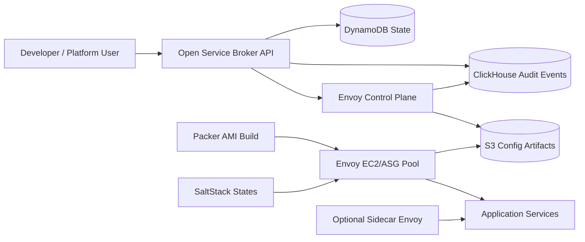

# Architecture

## Public source basis

Publicly available summaries of the referenced video describe a platform built around an Open Service Broker for internal provisioning, a centralized/self-service load-balancing layer, an Envoy control plane with dynamic templating, automated AMI creation with Packer/SaltStack, multi-region deployments, and sidecar services.

## Clean-room implementation

## Control flow

1. A developer provisions a load balancer through the OSB-compatible API.
2. The broker validates listeners, routes, clusters, and target endpoints.
3. Desired state is stored in DynamoDB.
4. An audit event is written to ClickHouse.
5. The control plane renders a versioned Envoy config.
6. Config is published as an immutable S3 artifact.
7. Envoy capacity pools or sidecars consume that config.
8. Updates create a new version and keep rollback options available.

## Production deployment model

- **Regional mode:** One ASG-backed Envoy pool per region.
- **Multi-region mode:** multiple regional pools fronted by DNS, GSLB, or cloud traffic manager.
- **Sidecar mode:** app-local Envoy containers pull per-app configs.
- **Config versioning:** every update produces `instances/<id>/v<version>/envoy.yaml`.
- **Auditability:** all lifecycle actions land in ClickHouse for dashboarding and detection.

## Security hardening hooks

- Broker basic auth locally; replace with OAuth2/OIDC/mTLS in production.
- S3 bucket policy should be read-only to Envoy runtime roles.
- DynamoDB access should be least-privilege by service role.
- Control plane should validate all generated Envoy configs before publish.
- Add signing for generated config artifacts in high-assurance deployments.
