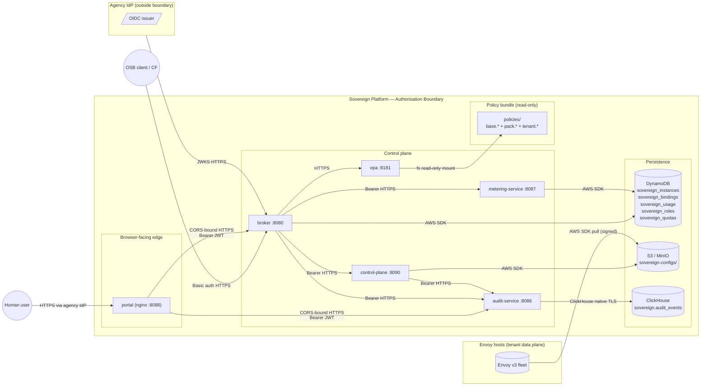

# Authorisation Boundary, Data Flows, Ports & Protocols

> Phase 5 task 5.5. Source-of-truth for the boundary diagrams, data
> flows, and encryption mapping. An assessor or AO should be able to
> read this file and the SSP control mappings without a walkthrough.

## 1 — Authorisation boundary



The boundary contains every component that processes chassis-managed
data. The agency IdP and the Envoy data plane sit outside the boundary
but exchange traffic across it through the documented interfaces.

## 2 — Data flows

| # | From | To | Protocol | Port | Direction | Auth | Encryption-in-transit |
| --- | --- | --- | --- | --- | --- | --- | --- |
| 1 | Human user | portal | HTTPS | 443 | inbound | OIDC at agency front door | TLS 1.3 (agency LB) |
| 2 | OSB client (CF) | broker | HTTPS | 8080 | inbound | OSB Basic | TLS 1.3 (agency LB) |
| 3 | portal | broker | HTTPS | 8080 | inbound (browser-originated) | Bearer JWT | TLS 1.3 |
| 4 | portal | audit-service | HTTPS | 8086 | inbound (browser-originated) | Bearer JWT | TLS 1.3 |
| 5 | broker | control-plane | HTTPS | 8090 | east-west | Bearer (shared chassis token) | TLS 1.3 (in-cluster mTLS optional, controlled by service mesh) |
| 6 | broker | audit-service | HTTPS | 8086 | east-west | Bearer | TLS 1.3 |
| 7 | broker | metering-service | HTTPS | 8087 | east-west | Bearer | TLS 1.3 |
| 8 | broker / control-plane / metering-service | OPA | HTTPS | 8181 | east-west | none (loopback within boundary) | TLS 1.3 (in-mesh) |
| 9 | broker | DynamoDB | AWS SDK | 443 | egress (within VPC endpoint) | SigV4 (IAM) | TLS 1.3 |
| 10 | metering-service | DynamoDB | AWS SDK | 443 | egress (within VPC endpoint) | SigV4 (IAM) | TLS 1.3 |
| 11 | control-plane | S3 | AWS SDK | 443 | egress (within VPC endpoint) | SigV4 (IAM) | TLS 1.3 |
| 12 | audit-service | ClickHouse | ClickHouse native TLS | 9440 | egress (within VPC peering) | password + TLS | TLS 1.3 |
| 13 | broker | agency IdP JWKS | HTTPS | 443 | egress (allow-listed) | unauthenticated GET | TLS 1.3 |
| 14 | Envoy host | S3 | AWS SDK | 443 | egress | SigV4 (instance IAM role) | TLS 1.3 |

## 3 — Encryption at rest

| Store | Data | Mechanism |
| --- | --- | --- |
| DynamoDB (`sovereign_*` tables) | Service instances, bindings, usage, roles, quotas | AWS KMS CMK (default for GovCloud accounts; agency-owned key in IaC). |
| S3 (`sovereign-configs/`) | Rendered Envoy bootstrap configs | SSE-KMS with agency CMK; bucket policy enforces `s3:x-amz-server-side-encryption=aws:kms`. |
| ClickHouse (`sovereign.audit_events`) | Audit trail | EBS gp3 volume encrypted with the agency KMS CMK. |
| OPA bundle (`policies/`) | Rego sources | Container image layer, signed at build with keyless cosign and verified by admission policy. |

## 4 — Port allow-list (summary)

```
ingress to boundary:
  443/tcp  agency LB → portal :8088 (rewritten by LB)
  443/tcp  agency LB → broker :8080 (rewritten by LB)
  443/tcp  agency LB → audit-service :8086 (browser-origin only, CORS-gated)

east-west (cluster-internal):
  8080  → broker
  8086  → audit-service
  8087  → metering-service
  8090  → control-plane
  8181  → opa
  8088  → portal (nginx serves static SPA)

egress from boundary:
  443/tcp  → DynamoDB regional endpoint (VPC endpoint)
  443/tcp  → S3 regional endpoint        (VPC endpoint)
  9440/tcp → ClickHouse cluster (within agency VPC)
  443/tcp  → agency IdP JWKS endpoint (allow-listed FQDN)
```

## 5 — Trust boundaries summary

| Boundary cross | Authn at crossing | Authz at crossing |
| --- | --- | --- |
| Human → portal | Agency IdP (OIDC) | none at crossing; portal is static |
| portal → broker / audit | JWT bearer (verified per request) | RBAC via `_enforce_rbac` |
| OSB client → broker | HTTP Basic | bypass RBAC; OSB system-tooling assumption |
| broker → control-plane / audit / metering / OPA | shared chassis bearer token | the service trusts the bearer-bound principal |
| chassis service → AWS resource | IAM (SigV4) | IAM policy in agency IaC |
| audit-service → ClickHouse | ClickHouse user/password over TLS | ClickHouse role |
| Envoy host → S3 | IAM instance role | bucket policy restricts to artefact prefix |
